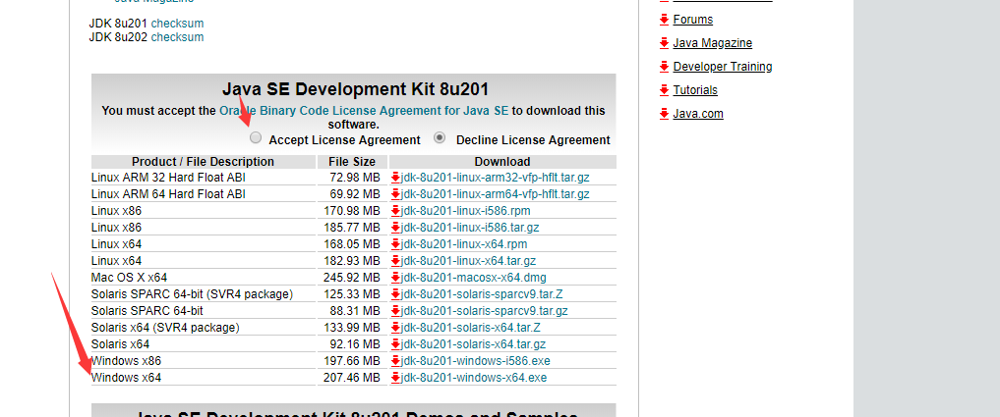
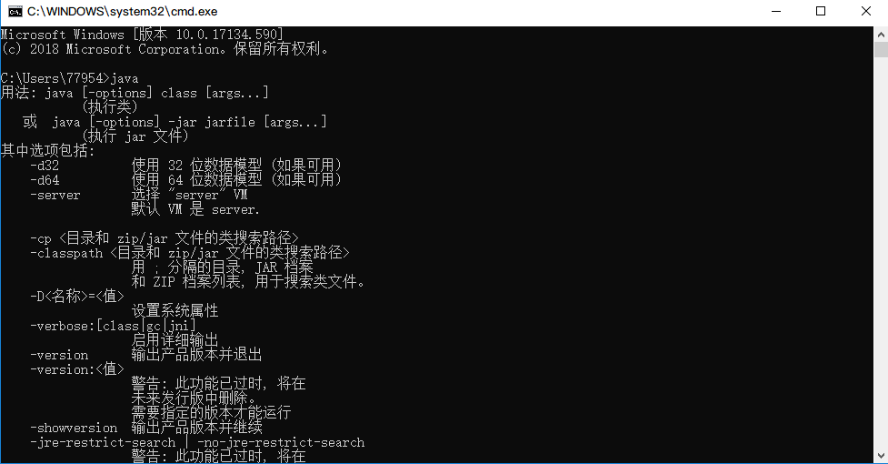
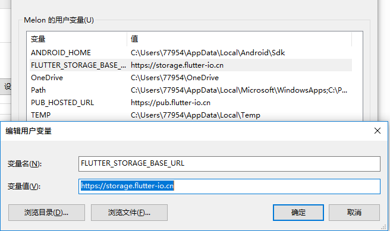
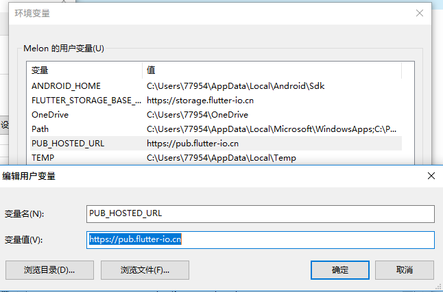
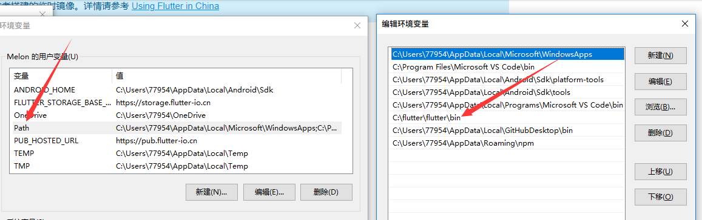

# Flutter

## 简介
Flutter是谷歌的移动UI框架，可以快速在iOS和Android上构建高质量的原生用户界面。

[github地址](https://github.com/flutter/flutter) <br/>
[官网](https://flutterchina.club/)<br/>
[awesome-flutter](https://github.com/Solido/awesome-flutter)

## 环境搭建 (windows)
### 系统基本要求
#### 操作系统：window7以上64位操作系统
#### 需要GIT环境


## 第一步:安装JAVA环境

[Java环境下载地址](https://www.oracle.com/technetwork/java/javase/downloads/jdk8-downloads-2133151.html)

####  如图点击下载安装:



#### 安装成功后在终端输入  java ，出现如下提示即安装成功




## 第二步:下载Flutter SDK 

[下载链接](https://flutter.io/sdk-archive/#windows )

#### 下载完成后，找到Flutter所在的目录，找到其中的flutter_console.bat，双击启动，即可运行Flutter命令

注意： 由于一些flutter命令需要联网获取数据，如果您是在国内访问，由于众所周知的原因，直接访问很可能不会成功。下边的PUB_HOSTED_URL和FLUTTER_STORAGE_BASE_URL是google为国内开发者搭建的临时镜像，需要更新环境变量.（也可直接使用翻墙软件）

#### PUB_HOSTED_URL=https://pub.flutter-io.cn
#### FLUTTER_STORAGE_BASE_URL=https://storage.flutter-io.cn

### 更新环境变量

#### 在“用户变量”下检查是否有名为”PUB_HOSTED_URL”和”FLUTTER_STORAGE_BASE_URL”的条目，如果没有就添加。  顺便把Flutter的环境变量也加入到Path中，这样即可在任何终端运行Flutter命令，如图(路径按照自己安装的目录设置)

<br/><br/>

<br/><br/>

<br/>

#### 重启电脑，然后在终端运行 flutter doctor 命令，出现以下提示即安装成功.(如果出现X号，这时可以不用管，一般是提示Android Studio或者证书未安装，随后会说明如何安装).


## 第三步:安装Android Studio

[AndroidStudio下载](https://developer.android.com/)

[AndroidStudio安装教程](https://www.cnblogs.com/xiadewang/p/7820377.html)


#### 安装完毕后，打开Android Studio，在Plugin配置中搜索Flutter插件点击安装，然后重启Android Studio。

#### 最后在终端再次输入 flutter doctor ,如果提示没有安装证书，可执行如下代码即可，Flutter环境基本就搭建完毕了。
```
flutter doctor --android-licenses
```


 
 